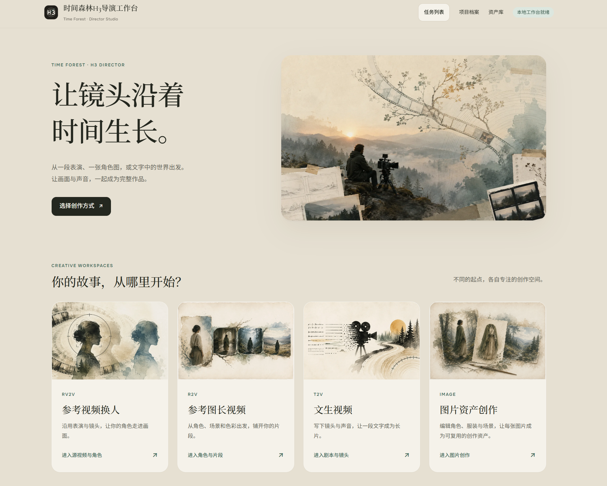
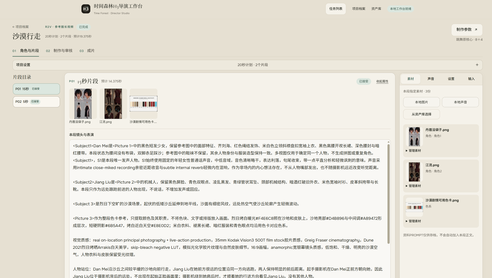
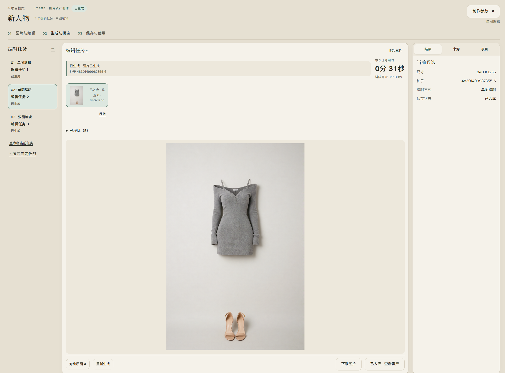
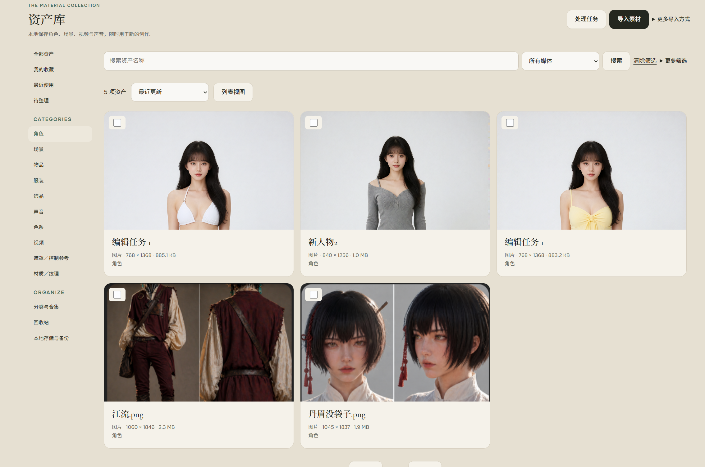

# 时间森林 TimeForest

**让 AI 创作，拥有一张赏心悦目的工作台。**

时间森林是一款注重视觉设计与交互体验的本地 AI 导演工作台。它基于 ComfyUI，将图片创作、角色替换、视频分镜、声画生成与资产管理组织在统一的界面中，让你围绕一部作品完成从素材准备、反复生成到审核成片的制作过程。

温暖的配色、清晰的步骤、连贯的操作，是时间森林的产品核心。无论是在画布中调整角色，还是逐段挑选视频结果，都能沿用熟悉的操作方式，把注意力放在画面、人物与故事上。

[五种模式](#五种创作模式) · [视频制作](#视频从素材与分镜走向成片) · [图片筛选](#生成与筛选让多次尝试更顺手) · [资产复用](#资产让素材成为可复用的创作积累) · [安装与启动](#安装与启动)

*首页｜截图展示 6.3.11 的四个入口；6.3.20 另增“视频接续”工作区。*

## 为创作设计的界面

时间森林采用纸色背景与森林绿强调色，搭配衬线标题、柔和边框和有层次的留白。画布、媒体预览与生成结果占据主要空间，参数、任务状态和辅助说明按层级呈现，形成协调的创作环境。

界面按制作步骤组织：准备素材、编排内容、生成挑选、保存使用。每一步围绕当前任务展开，让正在制作的内容、可执行的动作和下一步去向保持清楚。

五个模式共用制作参数入口、状态与计时呈现、错误反馈和候选整理方式。切换创作模式时，熟悉的操作保持一致；具体参数则按当前工具与工作流适配。

## 五种创作模式

| 模式 | 可以完成的创作 |
|---|---|
| **参考视频换人** | 以源视频的表演、动作节奏和镜头为基础，结合目标角色的脸、发型、体型与服装进行人物替换。支持自动切片、逐段指令、原片对照、审核与合成。 |
| **参考图长视频** | 从角色、场景等参考素材出发，编排多个分镜，按段生成并利用声画上下文接续，也可以在指定位置开始新场景。 |
| **文生视频** | 用文字组织镜头、人物、对白、环境声音与音乐，按分镜制作；支持的工作流还可加入图片或音色参考。 |
| **图片资产创作** | 提供文生图、单图编辑、双图编辑、局部重绘／移除和扩图。支持画布操作、候选挑选、继续编辑、快捷入库与视频引用。 |
| **视频接续** | 导入本地或资产库视频，沿片尾继续生成；选用结果追加为独立轨道片段，调整顺序后统一拼接导出。 |

五种模式围绕项目展开，生成结果可以沉淀为资产，资产也可以重新进入下一次创作。

## 视频：从素材与分镜走向成片

角色、场景和色彩参考与镜头正文放在同一个工作区中。左侧切换片段，中间编排当前镜头，右侧管理素材和声音，逐段组织一部作品。

*视频分镜｜参考图长视频中的素材与镜头编排，制作参数保留在右上角。*

### 分镜表达创意，工作台处理内部任务

故事模式按每段不超过 15 秒的用户分镜组织内容。工作台依据工作流要求规划内部渲染任务、合法帧数、上下文重叠和交付长度，减少围绕底层任务重复填写提示词的操作。

自然时长允许帧数约束带来的少量差异；精确时长通过规划与裁切处理目标长度。内部任务保留完成记录，条件兼容时可以接续未完成部分。

### 让后续片段接续你选用的版本

连续片段以前一段已选用的结果为上下文，支持逐段审核，也支持自动推进。换选候选或修改影响生成的条件时，工作台检查相关后续片段的依赖关系。

例如，第二段改选了新结果，依赖旧结果的后续连续片段会清除当前选用，直到新的场景边界。原候选仍然保留，方便重新比较和制作，避免旧上下文的结果混入当前成片。

### 将人物、画面与声音一起编排

当前 H3 工作流支持声画联合生成，并按配方处理连续段上下文。角色图片与音色参考可以关联使用：图片描述人物形象，声音参考指向音色与说话方式，新对白由创作正文表达。

参考视频换人可按配置保留源片原声或使用生成声音。从角色外观、表演到对白与镜头接续，相关素材和制作记录都保留在项目中。

## 视频接续：把已有片段继续向后制作

从资产库或本地导入视频，添加后续画面与声音描述，并按需指定参考素材。两种工作流分别适配跳舞 8＋4 和官方 Ref2VA；片尾上下文来自所选视频，原片保留。

满意的续接结果选用后成为左侧独立轨道片段，可以继续续接、调整先后顺序，最后统一拼接导出。来源页有制作时参数的片段可展开查看，方便手动匹配新一段设置。没有 AI 续接需求时，也可直接将已有视频排序导出。

这两种外部尾部适配的真实连续性、声音与画质仍需在实际模型环境中验证。

## 生成与筛选：让多次尝试更顺手

创作往往需要多次尝试。时间森林保留候选结果与运行记录，让你比较、选用、重新生成，也可以移除明显无效的结果，保持工作区清晰。

图片模式可以在结果页直接重新生成，沿用当前素材、指令和参数追加候选；需要调整时返回上一步，满意时就在下载按钮旁加入资产库。将结果作为新底图继续编辑，也有独立入口。

*图片筛选｜任务目录、候选、大图与结果属性共同呈现，重新生成、下载和入库操作位于结果旁。*

制作参数按当前工作流分组呈现，并与实际执行参数绑定。取消保留原草稿，应用确认本次调整，再由项目保存流程持久化。图片参数还提供恢复默认，方便从多次尝试中回到起点。

全局任务列表让你切换页面后仍能查看执行中、排队和待确认任务，返回所属项目，并按任务状态取消等待或请求停止。统一的状态与计时帮助区分等待、执行和完成；异常时可以查看错误摘要与原始信息。

资产库内的统一回收站分为资产、项目和生成记录三类。移除内容可以恢复，图片编辑任务也可废弃与恢复；整理结果时保留已入库资产和已有引用。

## 资产：让素材成为可复用的创作积累

资产库管理图片、视频、声音和工作流资料，支持分类、合集、版本及素材绑定。你可以先准备角色图片与声线，再将它们用于多个镜头；也可以把满意的候选或成片收回资产库，留待后续使用。

*资产管理｜通过分类、搜索与缩略图浏览素材，将积累的角色、场景和作品用于下一次创作。*

项目引用固定的资产版本，并保留项目副本。资产库更新素材时，不会悄悄改变已有项目。生成结果入库时记录对应任务、候选及生成来源，便于追溯一份素材来自哪次制作。

一条典型流程是：**准备角色与场景 → 编排分镜 → 逐段生成与挑选 → 审核合成 → 收藏复用**。图片创作和视频制作由此形成连贯的工作过程。

## 已适配的工作流与本地运行

查看已适配的模型与工作流实现

视频基于 H3，提供适用模式下的官方 Ref2VA／T2VA 备选、原 8＋4 核心及文戏适配。原 8＋4 将同一 12 步采样日程分为两阶段，中间进行学习型潜空间放大，并以二采声画结果交付；连续段使用经过来源校验的无损图像尾部与对齐声音。

图片基于 Krea 工作流及文生图派生分支。模型、采样、LoRA、尺寸和适用的低显存选项按当前能力提供，已适配的生成核心继续共用项目、审核和资产流程。

网站本地运行，项目与资产保存在配置目录。需要自行准备 ComfyUI、对应模型与节点；安装说明以 Windows 为主。生成引擎未启动时，仍可整理资产和编排项目。详细步骤见[安装与启动](#安装与启动)。

## 当前范围与许可

时间森林面向已适配工作流的创作与项目管理。新的工作流结构需要开发适配；视频接续支持顺序轨道编排，复杂多轨时间线剪辑和任意节点图编辑不在当前功能范围内。

实际速度、显存占用、人物一致性与片段衔接效果取决于模型、配置和设备。新增文生图已完成隔离界面、保存与参数绑定检查，真实生成效果仍待验证；局部编辑不保证区域外像素完全不变。

项目代码沿用 [MIT 许可](LICENSE)。模型、插件、工作流和其他资源遵循各自的使用条件，详见[第三方来源](THIRD_PARTY_NOTICES.md)。

## 安装与启动

> 工作流文件单独分发，GitHub仓库不包含这些JSON或配套压缩包。首次运行前，请下载下方配套工具包，按[配套安装说明](docs/release-distribution.md)补齐文件。

**v6.3.20 配套工具包下载：[夸克网盘](https://pan.quark.cn/s/5021b399eb1a?pwd=k4iH)　提取码：`k4iH`**

本次变化见[更新日志](CHANGELOG.md)。

包内包含工作流、模型选用名称TXT与安装说明；解压后将 `install/` 内的内容复制到网站根目录，保留子目录结构。

1. 准备 Python 3.10+，将 FFmpeg、FFprobe 加入 PATH。生成需要自行配置 ComfyUI、相应模型与节点。
2. 解压配套包，将其中 `install/` 的内容复制到本仓库根目录，保留目录结构。模型名称及启用/可选状态见包内TXT；不需要为不同工作流安装全部模型。
3. Windows运行 `setup.bat` 安装网站依赖，或自行建立虚拟环境并安装 `requirements.txt`。前端无需Node构建。
4. 复制 `config.example.json` 为 `config.json`，填写自己的 `comfy_url`、`comfy_input_dir`、`comfy_output_dir` 和 `asset_library_dir`。相对路径以网站目录为基准，输入/输出须指向同一套ComfyUI。
5. 运行 `start.bat` 或 `.venv\Scripts\python.exe run.py`，打开 http://127.0.0.1:5093/ 。也可使用 `tools/director-menu.cmd` 启动、停止或重启网站；菜单里的“卸载”只停止服务，保留程序和数据。

网站不会自动安装ComfyUI或模型。首次使用时按自己的路径配置引擎；无需生成时也可整理资产与编排项目。

## 数据与维护

- `data_v5/` 保存项目、素材与运行记录；`data/` 保留旧项目兼容读取。
- `asset_library_dir` 指向独立资产库，默认位于仓库同级的 `TimeForestAssets/`。
- `config.json`、模型、配套工作流、缓存、数据库和用户作品均不提交Git。
- 用户数据需要单独备份，回退代码不会回退作品。

维护入口：[AGENTS](AGENTS.md) · [项目地图](PROJECT_GUIDE.md) · [当前状态](docs/maintenance-baseline.md) · [检查与交付](docs/governance/checks-and-release.md)。

本项目沿用 h3-video-chain-ui 的实现与MIT许可，保留原作者署名。公开版本采用整理后的源码快照；原本地开发历史未随首次发布上传，详见[第三方来源](THIRD_PARTY_NOTICES.md)。
