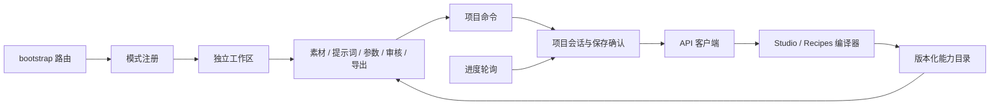

# 时间森林前端维护入口

四模式计时统一复用 `ui/run-timing.js`：以用户认可的图片状态行作为视觉标准，左侧紧凑状态/辅助说明，右侧用途标签、26px等宽数字和可选排队时间。`features/image-results/workspace-view.js`、`production/records.js`、`source-preparation/index.js`、`export/index.js` 共用 runStatusRow / runTiming；公共 CSS 在 styles/components.css，视频不再另覆写20px字号。业务层只适配真实时间与状态，不复制布局。图片控制器原 watchClocks(root)、视频 watchProject 的一秒刷新和销毁机制保留；时钟只更新文字。复用规则及组件位置见[公共交互契约第11节](parameter-and-interaction-contract.md#11-公共设计复用与计时标准)，图片时间来源见[图片模块](../image-assets.md)。

视频工作区的辅助区域由 `styles/workbench.css` 管理视觉层级：`workspace-draft-note` 是紧凑草稿提示，进度容器共用工作区边框/圆角并取消重复底色和阴影，细进度条与次级节点文字降低信息重量；审核工具栏标签/控件水平对齐。改动仅涉及呈现，生成、草稿和审核命令不变。图像画布、三个视频对照与属性区的位置保留，窄屏沿用原工作区滚动。

资产库回收站接入 `pages/asset-library/recycle-bin.js`，三分类共享壳层、确认、错误反馈与 `styles/library.css` 中的回收站行样式。只读分类API汇总旧标记，恢复沿用原业务接口与revision，离开页面AbortSignal阻止迟到回写。旧trash=1链接兼容，原项目内恢复入口保留。详见[分类回收站](../recycle-bin.md)。

网站壳层的“任务列表”由 `features/task-center/index.js` 在 bootstrap 装配一次，使用独立 dialog，跨页保留入口，仅呈现当前执行、排队与待确认占用，完成后移除；历史留原项目。原单个 `active-task` 链接已由此替代。具体停止语义、状态与焦点/轮询约束见 [当前任务队列](../task-queue.md)。

维护现有网站，沿用已认可的三个视频工作区、图片画布、四个编辑工具及文生图、公共 UI、资产库和生成核心。当前入口版本与交接事实统一见[维护基线](../maintenance-baseline.md)。图片保留导演工作区 V3 视觉组件，制作参数已接入共用分类对话框与临时草稿规则；实际行为见[统一参数与交互契约](parameter-and-interaction-contract.md)，布局及待体验边界见[图片工作区 UI 维护说明](image-workspace-ui.md)。代码接入不代表用户体验或真实生成通过。

现有前端由应用壳层、项目服务、功能模块和独立创作工作区组成。界面使用原生 ES Modules，服务端是 Flask；无需新增打包服务。正式入口为 `static/index.html`，前端代码为 `static/studio/`。下表未带前缀的前端路径均相对于 `static/studio/`。

产品入口按用户任务组织。相同用途的新工作流进入原功能的工作流选择器，参数和必要输入随当前功能、工具及所选工作流适配；只有真正新增用户任务才按[添加创作模式](adding-a-mode.md)新增模块。模型家族可以继续承担内部适配与代码复用，不据此新增一级导航或重构现有工作区。普通模型／LoRA 文件更新见[本地模型目录](../local-model-catalog.md)；它不构成新工作流认证或发版。

每次开发交付同时更新相关用法、[参数映射](parameter-map.md)、必要的公共契约与 AGENTS 路由，再校准维护基线并刷新上下文索引。维护动作必须反映行为、路径、检查和待验收状态的实际变化；不能只改日期或留到下一次会话。执行方式见[上下文维护契约](../governance/context-maintenance.md)。

候选与历史运行整理共用 `ui/candidate-records.js` 的按钮、确认和“已移除”区。图片接入 `image-results/workspace-view.js` 与图片控制器，三视频接入 `production/review-parts.js` 与 `review.js`；各自原会话保存门保留。可见候选过滤 `removed_at`，恢复入口读取原记录；详见[候选记录整理](../candidate-records.md)。

## 从需求定位代码

| 修改目标 | 入口 | 边界 |
|---|---|---|
| 首页、最近制作、项目档案 | `pages/home.js`、`pages/archive.js` | 封面来自项目数据；缺少参考图时显示项目文字封面 |
| 真正新增用户任务的模式、名称、入口 | `app/mode-registry.js` | 只注册元信息和懒加载函数；同用途工作流走[工作流适配](../governance/workflow-evolution-contract.md) |
| 模式步骤、主布局和审核对照 | `modes/*/workspace.js` | 可组合 features；不直接保存项目或提交生成 |
| 保存、预览、草稿、版本冲突 | `core/project-session.js` | 每个项目一个会话；不依赖页面布局 |
| 检查、生成、审核、导出 | `core/project-commands.js` | 唯一命令入口；保存→影响确认→提交 |
| 进度订阅、计时 | `core/progress-channel.js` | 每次最多一个轮询请求；离开销毁计时器 |
| 素材上传、版本、绑定、继承 | `features/assets/index.js` | 素材库与分镜引用分离，改用途生成新素材版本 |
| 视频工作流参数界面 | `features/workflow-settings/index.js` | 显示后端能力声明，不另写工作流能力规则；新增字段走[参数映射](parameter-map.md)与[交互契约](parameter-and-interaction-contract.md) |
| 图片任务、画布、候选与入库界面 | `app/image-workspace-controller.js`、`features/image-results/workspace-view.js`、`features/image-canvas/index.js` | 任务废弃复用确认/保存门，零任务空态可新增，回收站可恢复；第二步重新生成复用原任务提交入口，下载旁快捷入库不选用/不切页，第三步保留结果继续编辑；保留图片任务作用域和现有画布实例；应用参数不重建画布或上传未保存遮罩 |
| 图片参数临时副本与字段呈现 | `features/image-settings/index.js`、`core/image-session.js` | 参数只从右上制作参数入口调整；恢复默认按当前工具从后台 defaults/models 写临时副本；弹窗取消丢弃副本，应用到任务草稿，保存仍走图片 change-plan/apply |
| 图片目录契约与实际服务版本 | `core/image-catalog.js`、`app/bootstrap.js` | 进入图片工作区及刷新目录时校验真实 API 的参数契约；旧后台缺描述时明确提示重启网站服务，不显示空参数窗口 |
| 共用制作参数入口、外壳和控件 | `ui/production-settings.js` | `productionSettingsAction` 统一四工作区顶部按钮与工作流说明；分类导航及字段共用，不拥有业务会话或改变保存作用域 |
| 参数真实约束和编译绑定 | 仓库根 `h3ui/studio_capabilities.py`、`h3ui/studio_recipes.py`、`h3ui/image_studio/{parameters,compiler}.py` | 后端为权威；图片 `parameters` 按五工具精选，见参数映射文档 |
| API 与实际错误原文 | `core/api-client.js`、`ui/error-feedback.js` | 保留错误分类、状态和原文；按文本转义展示，可展开或复制，不推测唯一原因 |
| 公共控件与视觉 | `ui/primitives.js`、`styles/*.css` | 模式局部布局放 modes.css 对应命名空间 |

依赖方向：`app → modes/features → core/contracts/ui`。core 不导入 modes；模式不相互导入。工作区由 `mountWorkspace` 组合能力，features 仅依赖传入的公开 context。禁止重新增加全局 `project/dirty/shot` 变量，也不要在三个模式中复制保存或轮询逻辑。

## 三种工作区

- 换人：源表演与目标角色 → 分段与替换 → 源视频/结果对照 → 成片。手机依序排列源视频、目标角色和分段，不挤成双栏。
- 参考图：项目素材集＋图文分镜板 → 画面与角色参考对照 → 成片。手机先展示当前分镜，再展示可复用的素材集。
- 文生：镜头目录＋剧本稿纸 → 剧本/画面对照 → 成片。声音、场景和参考资产按需展开；手机保留横向镜头目录。

通用审核队列和导出服务继续复用；不同模式通过 `reviewComparison` 提供各自所需的对照布局。模式也可以用 `renderPage` 完全替代公共页面组合。

### 合成的页面归属

合成统一属于“成片”步骤。最后一个待审核片段显示“完成并合成”；审核接口成功后，命令层发出 `export-started`，工作区立即进入成片页。普通审核和被服务器拒绝的审核不跳转。显式导出先完成保存/影响确认，再进入成片页提交；取消保存不跳转。

`core/export-lifecycle.js` 处理自动任务的合成/完成状态边沿，兼容两次轮询间已经合成完的短任务。刷新时若项目正在合成，直接打开成片页；相同状态重复上报不强制抢回用户手动选择的页签。成片模块负责合成进度与计时，不展示采样节点计数；后台尚无 FFmpeg 百分比上报，因此进行中使用不定量进度条，完成后才显示完成值。回归检查在 `tests/studio_export_navigation.test.mjs`，浏览器隔离检查不调用真实生成服务。

### 参考素材与连续声画

分镜字段 `asset_mode` 独立于 `boundary`：`auto` 为旧项目默认值，本段 assets 为空时沿用 P1，并追加 inherit_ids；`custom` 仅采用本段 assets 与显式 inherit_ids；`none` 不提交任何图片/声音参考，保留列表便于恢复。上传/绑定素材进入 custom；显式沿用只提交勾选项，空选项不会再悄悄恢复 P1。

前后端均按这个规则解析素材。预览、保存、归档、草稿恢复、内部任务展开和候选审核均保留该字段。后端目录返回 `asset_reference_modes` 后才开放新控件，避免后端尚未重新加载时显示无效选项。缺少字段的旧记录按 auto 处理，不仅因字段补默认值就让结果过期。

图片长视频和带参考的文生长视频，只有明确选择 none 且有上下文的连续片段，才允许跳过重复参考输入。首段/新场景仍执行原模式的输入检查；换人仍要求目标角色图。none 不更改 head、boundary、previous，也不关闭 Motion Context。跳舞原核心续接仍读取上一段二采无损尾部及声音，其余配方继续采用各自的 AV 上下文路径。真正提交前仍要求上一段已接受且上下文存在。结构检查见 `tests/test_asset_modes.py`；页面状态检查见 `tests/studio_asset_modes.test.mjs`。这不代表长链身份一致性已经过生成实测。

## 视频状态与生命周期

`ProjectSession` 拥有 project、dirty、保存中的 Promise、预览序号、草稿缓存、AbortController 和订阅集合。路由加载使用 epoch 与取消信号；旧请求不会写入新工作区。预览响应只更新规划字段，保留请求期间新写的正文。

保存合并重复请求，先获取 change-plan；取消影响确认不 apply，更不会生成。进入制作、导出或点击生成都会经过同一个保存门槛。失败保留草稿，错误可见。真正生成成功只以服务器返回为准；提交阶段只说明正在提交，不伪造采样进度。

轮询只更新进度时，不重建编辑器或播放器；结构状态变化时保留同一 src 的媒体 DOM、焦点、选区和滚动位置。离开工作区会停止轮询和计时、取消未结束的读取、清除订阅，调用模式 cleanup 和 dispose。离开不会终止服务端 GPU 任务。当前浏览器会话记录每个项目上次页签及分镜位置，不将未保存正文写入浏览器存储。

## 设计决策

1. 保留原生 ES Modules：当前部署无需 Node 构建服务，便于本机更新与排查；拆分后再按需求决定是否引入框架。
2. 保留 `#/p/<id>` 路由和 `/api/v5` 接口。V6 是前端版本，不强迫旧数据迁移。
3. 目录新增 `contract_version: 2`、每配方 `parameters` 与 `capabilities`，保留旧字段。旧客户端可继续读取；新客户端不会在缺少契约时伪装参数可用。
4. 使用 Noto Serif SC 中文标题、Noto Sans SC 中文正文，沿用 Onest 数字与拉丁正文、Cormorant 英文编辑标题；字体按 unicode-range 本地加载。
5. 浅棕背景、暖纸内容、深墨主操作、森林绿选中。正文和小字颜色经过对比度计算；动效只用于短暂入场及控件反馈，支持减少动态效果。

## 验证与历史发布证据

维护检查入口包括 `tests/studio_frontend.test.mjs`、`tests/test_ui_capabilities.py`；图片修复另有 `tests/studio_parameter_dialog.test.mjs`、`tests/studio_image_interactions.test.mjs`、`tests/test_image_parameters.py` 与 `tests/test_image_studio.py`。按[相关检查与交付](../governance/checks-and-release.md)选择受影响路径，不将全部历史用例当成必须重复的检查矩阵。

`tests/image_parameter_ui_fixture.py --real-image-api` 用真实图片路由、临时 SQLite 和真实目录扫描假文件提供图片界面检查，catalog 原样交给前端；三视频为合成 API 对照。不加选项时保留原内存 API、模拟目录/错误/保存/运行记录模式。两种模式都不读取生产项目或连接生成引擎，`tests/test_image_api_ui_contract.py` 另检查真实接口到前端及保存/编译的衔接。具体检查结果、实际旧后台重载状态与待用户体验项见[维护基线](../maintenance-baseline.md)。历史5094浏览器验收不表示本轮启动了该服务；生产项目不用于测试写入。

详细证据和备份位于 `D:/导演台归档-20260906/历史工作目录/time-forest-upgrade/visual-polish-v1/`。参阅其中 `checks/验收记录.md` 与 `发布与回退.md`。当前维护目录与归档边界见 [维护基线](../maintenance-baseline.md)。

## 导演工作区 V3 接入规范

历史实施及验收见 [V3 实施记录](D:/导演台归档-20260906/退役代码与资源/docs/plans/director-workbench-v3-implementation.md)。该记录的静态入口 6.2.4 是历史版本；当前版本只在维护基线登记。视频输入契约仍为 input_contract_version=2，图片项目 API 快照另有 image_contract_version=1，不将其混作单次生成运行快照字段。

| 公共层 | 责任 |
|---|---|
| ui/workbench.js | rail/canvas/inspector 插槽、实际视口高度、属性页签与键盘移动 |
| ui/media-player.js | 显式播放、原生控件、拖动、加载错误、重试、播放位置恢复 |
| ui/input-inventory.js | 当前草稿有效输入；版本与素材变化时丢弃旧响应 |
| ui/production-settings.js | 图片与视频共用顶部制作参数按钮、外壳、分类导航与字段；底模／编码器／VAE 使用 select，LoRA 使用可输入的 datalist，图片种子沿用随机／固定表达 |
| ui/error-feedback.js | 错误摘要、实际原文、复制反馈；文本转义，保留收到的错误分类 |
| features/prompts/authoring.js | 素材/声音/设置/输入属性，声明式素材命令、正文输入 |
| features/production/review-parts.js | 审核属性及动作，沿用唯一项目命令入口 |
| styles/workbench.css | 编辑器专用密度、滚动边界、参数分类、资产详情适配 |

组件示例为 `/static/studio/design-system.html`。它只展示组件；缺失视频是用于检查错误/重试的故意样例。三模式样张直接使用隔离项目，避免维护与实际页面脱节的另一套静态页面。

- 1280×720 起，片段目录、正文/媒体、属性拥有自己的滚动区，动作栏留在工作区底部。窗口宽度≤850或高度≤620时重排，允许必要整页滚动；不锁死 body。
- `inspectorTab`、`inspectorHidden` 属于会话呈现，不进入 settings、修订或生成摘要。切属性不会使结果过期。
- 每个动作作用域保留一个主要动作。单段生成与整项目生成是不同作用域；人工模式明确写“开始逐段制作”，不再误称全部自动合成。
- 参数对话框按任务分组，只显示当前分类。局部操作放到该对象的管理菜单；不得在渲染后追加一排不属于对象的按钮。
- 图片编辑属性为素材／输入／项目，不再设置“设置”页签或第二个制作参数入口。项目名称在“项目”属性中编辑并随草稿保存；扩图四边、目标比例与锚点放在画布工具的“扩边设置”，与画布拖动共用任务字段。采样、种子、模型、像素面积及双图/文生图输出比例只在右上参数对话框调整。
- 新静态文件不证明运行中的网站进程已更新。图片入口与目录刷新通过 `assertImageCatalog` 核对 `parameter_contract_version=1` 及原四工具字段形状，并按声明/当前任务额外核对文生图能力和text字段；旧后台或缺失描述明确显示网站版本不一致。保存已有编辑后重启网站服务再刷新，无需启动 ComfyUI；失败刷新保留已有临时参数和目录。
- 媒体轮询保留同 src 的 video DOM，结构切页按 src 恢复位置；暂停的媒体不会自行播放。新媒体必须使用共用播放器并在工作区统一绑定，不创建第二个轮询。
- 减少动态效果延续现有 prefers-reduced-motion。键盘属性页签支持左右/Home/End；只在页签按钮处理这些按键，不截断中文正文输入。

原低潜空间两采、低显存插件、素材继承、自动保存、人工审核及合成服务继续复用。UI 通过能力目录和统一有效输入清单适配，不构造虚假的工作流参数。

文生图沿用图片控制器/会话/工作区三步骤，无A/B/画布实例；跨文生图与编辑工具另建任务并保留原草稿，后续经原保存门持久化。text能力由catalog.text_to_image_version=1及parameters.text确认；运行模型角色与节点检查依实际工具。现有参数弹窗忽略前次关闭事件，快速重开仍能应用。来源/参数详见[参数映射](parameter-map.md#文生图派生适配)，隔离检查增加tests/test_image_text_generation.py。
