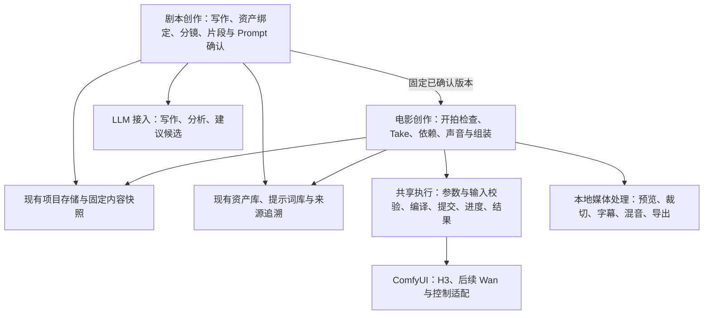

# 剧本创作与电影创作：代码映射和实施建议 V1

2026-09-09；依据用户《TimeForest 剧本创作模式与电影创作模式：整体设计思路》的 0～65 节、当前 v6.3.32 工作树和本日核对的上游资料。本文是研究与设计建议，不是已实现功能或开发完成报告。用户本轮要求理解并思考实现，尚未要求执行本方案；没有修改运行代码、访问生产项目、运行 ComfyUI、安装或发布。

## 1. 总体判断

建议新增两个真正独立的产品模式：**剧本创作负责创作与确认，电影创作负责执行与采用**。项目档案、资产库、提示词库、公共体验、生成通道与媒体处理继续共用。参考图长视频保持轻量。

最重要的新增能力不是两个入口，而是：

1. 人类剧本、资产完整版、分镜、生成片段、各家族 Prompt 的分层内容和确认关系。
2. 修改后保留旧成果、提出影响建议、由用户决定应用范围。
3. 电影引用固定剧本版本，制作调整独立保存；每次 Take 绑定生成时的确切输入。
4. 依赖“已正式采用的某个 Take”的制作计划，与最终剪辑顺序分开。
5. 跨模型视觉控制描述，以及真正消费这些描述的工作流适配。

推荐结构：

本图表示职责，不要求按每个方框新建服务或数据库。LLM 的输出先成为建议候选，不能直接执行改项目、资产写入、视频生成或工作流代码。

## 2. 设计概念到现有代码的映射

下列路径均相对仓库根目录。“可复用”不代表无需登记新模式；现有代码仍有明确的模式分支。

| 设计概念 | 真实现状与入口 | 实施判断 |
|---|---|---|
| 剧本项目、电影项目 | `h3ui/studio_store.py:StudioStore` 有项目 JSON、revision、暂存预览与事务应用；接续在 `video_assembly/service.py:create` 中已经复用它 | 沿用同一项目身份、档案、删除恢复和文件根目录，增加模式自有内容；不新造平行项目库 |
| 全文、资产完整版 | 当前没有相应作品对象；`studio_store.revision` 是并发版本，不是可回读的完整创作历史 | 新增分层内容、确认快照和来源关系，不能把 revision 当作历史全文已保存 |
| 项目资产与局部绑定 | `asset_library/project_import.py`、`generation/asset_adapter.py`、`asset_library/usage.py` 有固定版本引用、预览应用和提交后使用登记 | 扩展场景／分镜／片段作用域；资产身份仍来自原库，局部服装等状态归项目覆盖，不改库原件 |
| 人类分镜 | `studio_story.py:storyboard` 按每 360 帧建立外层条目；`replan` 按数组位置保留草稿 | 不能直接当全文分镜器。新分镜有稳定 ID、自由时长、独立排序，后端不按 15 秒重建内容 |
| 模型生成片段 | `studio_story.py:task_segments` 把一句句正文按权重分到内部任务；`studio_plan.py` 实现 H3 帧数规则 | 复用帧数与裁切计算，新增经人确认的自然切片；不把现有机械分配当 LLM 分镜能力 |
| 模型专用 Prompt | `prompt_library/store.py` 支持 text/fields、固定版本、分类；`families.py` 核实 H3/Krea2；`service.py` 保存后收录 | 项目保存每个目标／家族的正式文字及确认状态，库负责管理副本与复用；多家族并存需要扩展收录适配 |
| 图片参考与回绑 | `image_studio/service.py`、`features/asset-picker/result-import.js` 有图片任务、候选、精确入库 | 新增“从分镜创建图片任务”和“返回原分镜绑定”事务；不能直接假设现有图片工具能消费任意数量的角色图 |
| 视觉参考包 | 现有图片、声音引用和用途可复用；无独立轨迹编辑数据 | 新增参考角色、时间位置、轨迹文档；原图仍是库媒体，预览图属于可再生成的派生显示 |
| 视频执行 | `studio_recipes.py:Recipes.compile`、`comfy.py`、`studio_progress.py`、`studio_tail.py`；接续编译器已复用 Recipes | 在真实调用边界抽取执行能力，不调用另一个产品模式的完整控制器，也不复制整个 Studio 类 |
| Take | 原三视频 `segments[].attempts`、接续 `assembly.runs` 已记录候选及运行目录 | 复用候选身份、结果、回收与入库逻辑；电影的“正式采用”明确独立于浏览中的候选 |
| 正式采用 | `studio.py:finish` 生成完成会设置 selected；`approve` 还检查当前参数/文本，并可能自动导出 | 电影不能直接复用这些业务入口；生成完成仅产出候选，采用由电影命令执行，导出由用户点击 |
| 镜头依赖 | `Studio.previous` 和接续 `source` 处理顺序来源；`generation/source_lineage.py` 保存固定来源 | 现有链不是任意依赖图。新增电影的依赖计划，复用执行与来源记录，不把轨道相邻关系当依赖 |
| 前 Take 变化 | 原 `approve/reroll` 及接续 `invalidate` 会清除下游选用；接续 `parts` 拒绝与当前来源不一致的结果 | 与新文档要求不同。电影保留下游旧 Take 与已用来源，显示建议检查，允许用户确认保留；旧五模式行为不暗改 |
| 制作阶段局部调整 | `generation/drafts.py` 支持运行期间独立草稿，候选目录已有冻结记录 | 增加“剧本基线＋电影调整”的明示合成；局部调整不是修改源剧本，也不是复用保存草稿就已经完成 |
| 来源项目、制作记录、派生 | `asset_library/{origins,generation_records,lineage,descendants,generation_descendants}.py` | 扩展新项目／Take 的读取适配，复用详情、跳转、固定媒体版本和两类下游，不建第二套追溯 UI |
| 全局任务 | `task_center.py` 汇总现有几类任务；`jobs.py` 负责执行占用 | 新增剧本 AI 与电影任务适配，仍只展示活动及需处理状态，不把全部剧本和 Take 塞进任务中心 |
| 预览与拼接 | `video_assembly/{track,media}.py` 有排序、源区间、几何统一、声画拼接 | 抽出媒体操作和清单格式复用；电影依赖与采用校验使用自己规则，不直接调用接续 `parts` |
| 声音制作 | `studio_speakers.py`、`studio_prompts.py`、`studio_inputs.py` 有声音引用和 H3 声画描述；媒体层有音频裁切 | 当前不是独立 TTS、字幕对齐、BGM 轨道或混音系统，这些需新增执行适配与编辑数据 |
| 统一体验 | `ui/{workspace-chrome,workbench,production-settings,prompt-editor,result-view,run-timing,async-feedback}.js` | 复用整个公共外壳、生命周期和动作语义，模式只适配业务；参数字段仍由各能力提供 |

### 必须先处理的局部耦合

- `Studio.snapshot`、启动恢复、档案路由、回收站、`TaskCenter.snapshot`、资产结果读取和 `PromptLibrary.items/capture` 都含模式结构假设。仅往 mode-registry 加入口会出现误读或漏登记。
- `JobManager._reserve` 当前 GPU 并发为 1，同项目只有一个修改占用。独立镜头可以“同时准备、都进入就绪队列”，不等于现在可以同项目多 GPU 同时执行。
- 现有 `InputAdapter` 只注册原三视频模式；模型目录能列出 Wan 文件，既不等于 Wan 编译器已接入，也不等于它能接受 H3 输入。
- 图片现有单图／双图／局部／扩图／文生图各有输入约束，不能因为资产侧绑定了多角色，就静默拼图或丢图。

这些只在新调用方需要的地方提取小接口或增加适配，不先重写全站注册、存储与调度。

## 3. 数据关系：保留创作自由，同时记录制作事实

### 3.1 用同一项目存储，增加模式自有内容

建议剧本和电影继续由 `StudioStore` 提供项目 ID、revision、目录与事务，模式内部增加有版本号的内容结构。可以先使用项目 JSON 加目录内不可变内容快照，避免第一期强行迁移所有项目或新建作品数据库。具体字段名在开发小样中固定，不把本建议中的术语机械变成数据库表。

每层至少保留：稳定 ID、自然语言内容、内容版本、来源层版本、是否确认、确认所依据的内容指纹。排序单独保存，不用“第 18 项”作为永远的身份；分镜和片段拆合要保留 predecessor 关系。

不可变快照先原子写入，再以现有 revision 事务更新项目指针。中途失败的快照不能成为正式内容；重复应用依照同一操作标识幂等处理。项目保存仍是权威成功事实，库收录失败走现有快照补记机制。

### 3.2 剧本原文、Prompt、提示词库各有所有者

剧本项目拥有作品、场景、分镜、片段、家族 Prompt 的正式内容和确认状态。提示词库拥有可复用内容、分类、收藏、模板及固定版本。LLM 任务拥有输入上下文、建议输出和调用记录。

已确认 Prompt 需要项目内有可用的固定内容快照，即使提示词库被移动、移除或暂时不可用，也不能导致电影无法打开原稿。库条目编辑不直接覆盖项目，项目存档也不能因为库故障回滚。采用两个库的统一原子事务不是必要前提。

一个片段可同时保留 H3 与 Wan 的正式 Prompt。H3 的量化／混合变体不拆家族，但每份 Prompt 仍记录适用的任务类型、参考槽位和编写指南版本。**同家族可以共用写作原则，不代表 Ref2VA 与首尾帧的输入语义一样。**

剧本正文按“剧本”用途收录；剧本模式中写好的 H3 视频 Prompt 按“视频→H3”收录；图片任务的 Prompt 按“图片→Krea2”收录。不能按所在页面把一切归到剧本，也不能按“负责写字的 LLM 型号”给视频 Prompt 分类。LLM 服务型号作为创作来源记录。

### 3.3 电影固定引用一次已确认剧本快照

创建电影时选定源剧本确认快照并保存其副本、身份和摘要。同一剧本可以拍多个电影版本；源剧本后续变化提供差异与导入范围，不能实时覆盖已拍摄电影。

制作局部修改采用“基线＋明确覆盖项”。每次 Take 再冻结合成后的有效正文、工作流、模型文件、参数、种子、参考资产版本、视觉控制版本、源 Take、裁切范围、预处理版本和实际提交图。

需要回写时先生成针对源剧本相应版本的修改建议，用户查看差异再应用；源版本在等待期间变动就重新合并。不是整份电影覆盖原剧本。

### 3.4 确认、保存和影响范围不能混成一个按钮

“保存草稿”保存当前编辑；“确认该层”确认该份内容；“采用建议”把选中的 AI 候选写入草稿。三者含义固定。

内容版本变化时，下游保留当前文字与确认记录，同时派生“上游变化，待检查”。项目重命名、收藏等管理修改不应让所有 Prompt 过期；依赖指纹只包含相关剧情、绑定、参考、切片和 Prompt 输入。

缺失已确认家族 Prompt 属于开拍阻断；原有 Prompt 上游发生变化则提供“保留并确认例外／查看建议／重写”，不能一律当缺失。电影中允许导演手改已有 Prompt 并确认本次 Take；缺少一个家族的正式 Prompt 时不能暗中跨家族生成替代稿。

## 4. 剧本创作与 LLM 技术路线

### 4.1 推荐网站直接连接 LLM 服务

首期支持一个可替换客户端接口，优先覆盖本地 Ollama 和兼容接口服务（如 LM Studio），再按实际服务协议增加云端适配。LLM 不必须经过 ComfyUI；否则单纯写剧本也依赖图执行、节点安装与视频引擎占用。

Ollama 提供结构化输出；LM Studio 提供兼容接口的 JSON Schema 输出。但结构符合 JSON Schema 只说明格式可解析，不证明剧情、引用和时长正确。后端仍须校验目标 ID、场次归属、允许的变更范围和文本完整性。[Ollama 文档](https://docs.ollama.com/capabilities/structured-outputs)、[LM Studio 文档](https://lmstudio.ai/docs/developer/openai-compat/structured-output)。

保留一种将来通过 ComfyUI 文本工作流执行的适配接口，供已有相关环境的用户选择，但不将某个编剧插件或另一个导演台作为 TimeForest 的项目控制中心。

### 4.2 AI 助手用阶段指令和上下文组织，不先做多智能体系统

“编剧、资产分析、分镜导演、切片助手、Prompt 创作者”先实现为同一调用层下的不同任务类型和版本化指令。每次有明确输入范围、输出结构和可应用目标，而不是让一个长聊天历史决定作品状态。

完整剧本可以内部按大纲、场次、全文整理分段生成，目标仍是完整人类剧本，首次展示不按模型 15 秒切碎。用户可编辑自然语言；后台提取稳定场次与人物实体，提取结果有歧义时显示建议，不改写原文。

针对 8 分钟等长作品，上下文按“当前层已确认版本＋相关场次＋相邻片段＋事实摘要＋绑定资产的已选资料＋家族写作指南”组织。固定摘要保留来源和版本，不把全部库和历史 Take 每次发送。模型输出长度不足时保存未完成候选并允许继续，不能将截断正文标为已完成。

### 4.3 任务、停止和迟到结果

流式文字先进入 AI 候选区域，用户原文不随 token 到达变化。任务记录 provider、实际模型、指令版本、输入摘要、使用范围、开始结束和可获得的用量。失败保留已收输出；取消与重试不重新覆盖正文。

适配现有任务中心与统一计时；网络型 LLM 不应占视频 GPU 通道。本地 LLM 与 ComfyUI 若共用显卡，需明确共享资源配置并排队或提示用户释放，不能假设两个外部进程会自动协调显存，也不能未经设置卸载用户模型。

用户在等待 AI 时改了原段落，迟到结果仍可保留为候选，应用时比较输入版本，不把旧建议直接写入新草稿。云端配置在首次使用时说明发送范围，密钥仅在后端配置，不能写入剧本、提示词库、日志或工作流包。外部文本和素材说明作为资料，不获得调用工具或修改文件的权限。

### 4.4 时长是三个数，不是一个数

保存“创作目标时长”“模型计划交付时长”“实际采用媒体时长”。切片时还未正式选择模型，可以使用用户准备考虑的能力档位估算；最终选择具体工作流后重检合法帧数。超限时提出自然节拍拆分建议，由用户确认，不暗自拆掉已确认 Prompt。

当前 H3 的帧网格与 22 帧续接头部留在 H3 适配器里。8 秒、12 秒等编辑意图不能被后端悄悄变为另一时长，界面需显示计划值与差异。对白先给预估，电影阶段拿到真实声音再校准；不声称 LLM 可精确预测口播时间。

## 5. 视觉参考和 ComfyUI 路线

### 5.1 一个共同编辑概念，多个真正的执行适配

视觉参考保留原 asset/version/media/hash、用途、作用片段、时间位置和可选说明。轨迹独立保存 subject 或 camera 类型、对象稳定 ID、时间点、归一化坐标、可见性及插值规则；记录坐标系、原图尺寸和裁切映射。预览箭头图不替代原图或轨迹数据。

主体二维路径与摄影机三维位姿不是同一种数据。首期可以保存镜头的自然语言移动意图和二维预览；不能声称仅一条屏幕线就得到了物理正确的三维相机位姿。要做 Control-Camera 需额外定义空间／相机参数。

片段拆分要切分轨迹时间并重算局部时标；改尺寸／裁切要预览坐标变换；换了底图应标记控制待检查。只有确切能够转换的输入才传给工作流，不支持项保留在项目并明确提示。

### 5.2 已核实的路线与取舍

| 路线 | 已有上游能力 | 在 TimeForest 中怎么用 | 建议次序 |
|---|---|---|---|
| 现有 H3 Ref2VA／文字配方＋MotionContext | 网站已有真实编译和执行记录 | 首批电影生成沿用当前基础配方，复用已采用结果的合格尾部，保留原默认语义 | 首批主路径 |
| H3 首尾帧与时点引导 | ComfyUI 上游有 ImageToVideo 的 first/last 和 AddGuide | 新增明确的首、中、尾参考适配，不能把所有图塞成普通人物参考 | 视觉控制第一批 |
| H3 Fun ControlNet | 上游核心已有 MiniMaxH3FunControlNetApply；作者模型支持 Canny／Depth／HED／MLSD／Pose 等控制视频 | 引入相应控制模型及预处理产物，先做独立受控配方，不自动叠加到原 8＋4／文戏方案 | 后续明确选用 |
| Wan2.2 普通 T2V／I2V | 官方提供对应模型及 ComfyUI 路线 | 新建 Wan 编译、输入、参数、帧数与结果能力适配；不能仅在下拉框换底模 | H3 电影闭环后 |
| Wan2.2 Fun InP／Control | 首尾帧及多种控制条件 | 按真实工作流选择输入，控制图需要适配预处理；不同功能不是同一套万能 Wan 参数 | 按镜头需求加入 |
| Wan-Move | 点级潜空间轨迹引导及 ComfyUI 轨迹节点 | 是独立轨迹模型路线，适合消费结构化主体路径；不能假定普通 Wan2.2 权重自带这项能力 | 与轨迹编辑一起评估 |
| Wan2.2 Control-Camera | 作者提供专门相机控制模型 | 需要明确相机坐标／位姿，不以主体点轨迹冒充相机控制 | 三维控制后续 |
| Wan2.2 S2V | 官方声音驱动视频，有 ComfyUI 原生示例 | 用固定对白音频驱动相应片段，不视为普通 I2V 自带声音生成 | 独立声音阶段 |

来源：[H3 模型卡](https://huggingface.co/MiniMaxAI/MiniMax-H3)、[ComfyUI H3 节点实现](https://github.com/Comfy-Org/ComfyUI/blob/master/comfy_extras/nodes_minimax_h3.py)、[H3 Fun 作者模型卡](https://huggingface.co/alibaba-pai/MiniMax-H3-Fun-Controlnet-Union)、[Wan2.2 官方代码](https://github.com/Wan-Video/Wan2.2)、[Fun Control 教程](https://docs.comfy.org/tutorials/video/wan/wan2-2-fun-control)、[Wan-Move 教程](https://docs.comfy.org/tutorials/video/wan/wan-move)、[Control-Camera 模型卡](https://huggingface.co/alibaba-pai/Wan2.2-Fun-A14B-Control-Camera)、[S2V 教程](https://docs.comfy.org/tutorials/video/wan/wan2-2-s2v)。

这里的上游能力不代表本机已安装相应节点，也不代表时间森林已接入。具体开发应固定作者源图和实现版本，离线核对真实节点输入输出，不自动更新用户环境。

文档中的“H3 在参考图上画轨迹”应保留为产品需求。本次未确认它所指的具体节点／工作流：带箭头图片让模型理解属于语义引导，关键帧锚定属于时间条件，Fun ControlNet 属于控制视频，三者不可等同。若用户有现用轨迹工作流，后续直接核对它的输入与原始数据；目前不据此承诺 H3 原生读取任意路径 JSON。

H3 官方提及的 Context-IR 是托管的前处理体系，不包含在开放的本地基础模型中。TimeForest 可以依据公开 Prompt 指南设计自己的上下文组织，但不能把本地 LLM 改写称为官方 Context-IR。[H3 官方说明](https://huggingface.co/MiniMaxAI/MiniMax-H3)。

### 5.3 模型选择与能力展示

继续区分“用途”“主模型家族”“具体任务／工作流”“实际模型文件”。家族用于 Prompt 写作与分类；工作流决定是否接收首尾帧、声音、轨迹以及时长；文件选择沿用当前公共模型选择器。

公共参数弹窗继续由 production-settings 提供。新适配返回真实字段、分组、默认值、绑定与能力说明；不把 H3 参数表复制成 Wan，也不全量显示节点字段。切换先预览哪些确认成果可沿用、哪些输入无法消费，取消完全保留旧选择。

## 6. 图片模式往返必须形成完整闭环

从分镜或片段进入图片创作时，先创建可恢复的制作请求：源项目、目标稳定 ID、源内容版本、选中资产固定引用、用途与可编辑图片 Prompt 草稿。已有 Krea2 分支按实际工具接收零／一／两张输入。

人物、场景、服装资料可以同时出现在“本次制作意图”里，但只有用户选定且工具支持的图才成为执行输入。没有合适输入时，提供选择单图／双图编辑、文字生成或先准备组合参考的明确路径；不能静默将多资产拼成一张图，也不能把 H3 专用标签直接当图片 Prompt。

满意候选先走既有精确入库与幂等回执，再选择“绑定回原分镜／片段”，指定构图、首帧、尾帧或氛围等用途。绑定要检查目标是否仍存在、原稿是否变化；迟到结果可以另存资产、重新选择目标或取消，不强行回写。第一次入库成功而绑定失败应可重试绑定，不重复生成或入库。

返回入口保留之前步骤和目标，不依赖浏览器临时内存。图中出现新物件时，AI 可提出它与原稿的差异，但不能把图像识别猜测自动加入剧情事实。

## 7. 电影执行：Take、依赖和剪辑分离

### 7.1 状态分成三个方面

采用现有统一状态 UI，但底层不要用一个 status 表达所有事实：制作准备状态（缺输入／就绪）、运行状态（排队／执行／成功／失败）、编辑决定（未采用／已采用／锁定）。

生成成功 Take 可以预览和入库，只有正式采用后才进入电影当前版本。锁定属于编辑保护，不是永远不能修改；解锁后修改仍保留历史。选用新 Take 不自动开始下游生成或最终导出。

### 7.2 依赖是固定输入事实

每条依赖明确类型：无连续条件、上一 Take 尾部、首尾帧／中间状态引导、固定音频等。依赖图按稳定 ID 保存并检查缺项、自环和循环；镜头可自由重排，依赖不随着左侧上下箭头变化。

提交时解析并冻结确切父 Take 及媒体／尾部摘要。未采用的候选不能自动作为“当前正式结果”，但用户可以明确把指定 Take 作为一次制作参考，并形成局部制作选择。

例如 A 采用 Take02 后生成 B；后来 A 改选 Take04，B 的既有记录仍然写着 Take02。系统提示衔接建议检查，用户可以保留 B、预览连接或重做；没有自动清空 B、更改 B 的生成来源或递归重跑。

保留旧 B 后再生成 C，C 应基于当前明确采用的 B，而不是系统追着 A 新结果重新改 B。成片依赖告警和“媒体文件缺失”分开；后者不能靠确认例外变出不存在的媒体。

### 7.3 复用执行，但保持电影自己的决策

逐步提取 `输入冻结 → 编译 → 提交 → prompt_id 记录 → 进度 → 查历史 → 收取媒体 → 裁切与检查 → 返回候选回执`。现有 `Studio.generate_one/finish` 与 `Assembly.generate` 仍由旧业务适配消费回执；电影使用自己的采用、锁定与依赖规则。

保留相同运行目录中的 workflow/manifest/prompt/request/history 和精确来源。提交响应不明时先查已有 prompt_id／请求身份，禁止直接重试造成重复生成。停止只操作归属已核实的引擎任务，延续当前任务中心逻辑。ComfyUI 的队列／历史／WebSocket 作为执行事实，作品依赖与用户采用由网站负责。[服务接口文档](https://docs.comfy.org/development/comfyui-server/comms_routes)。

首期保持单 GPU 通道和同项目串行执行，允许独立镜头同时准备并进入就绪队列。未来多引擎并发需引擎身份、资源通道、项目写入粒度一起适配，不通过随便提高线程数实现。LLM 依赖建议不会绕过就绪条件。

### 7.4 作品组装

采用列表就是剪辑轨道，保存具体 Take、使用区间、顺序、声音策略和导出设置。拖动／上下箭头只改剪辑顺序，裁头尾只改使用区间。导出冻结这份清单，保留每个组成媒体的来源；成片入库使用现有源项目跳转、制作记录与派生查询。

第一版提供串接预览、缺片提示、裁头尾、原生声轨与最终拼接；后续增加基本交叉淡化、BGM、字幕与混音。转场会改变重叠时长，字幕与声音时点依据采用后的实际媒体重新计算，不能沿用原剧本估算总时长。

## 8. 声音、字幕与 BGM

声音有两条不同路径：

- H3 原生声画：当前已有基础，人物声音资料、对白与声景进入支持该输入的配方；输出的混合音轨不是可直接分开的对白／环境／音乐轨。
- 固定对白音频：在电影模式使用 TTS 适配或本地导入，得到明确时长与版本，再由支持声音驱动的工作流使用。可以研究 CosyVoice 和 Wan2.2 S2V；现有声音参考不能直接等同强制口型同步。[CosyVoice 作者仓库](https://github.com/QwenAudio/CosyVoice)、[S2V 原生示例](https://docs.comfy.org/tutorials/video/wan/wan2-2-s2v)。

剧本负责台词和声音身份，电影负责实际生成、选择和对齐。TTS 结果与其他声音一样入原资产库，不另建声音库。云／本地提供方以后接入同一任务回执，不让插件私有历史成为唯一记录。

首期 BGM 允许资产库或本地音频，生成音乐作为可选适配后续做。新增音量、淡入淡出和对白避让时复用本地媒体通道；不能默认在已有 H3 混合音轨上再叠一层相同音乐。字幕区分预估台词、人工校时和识别／对齐所得时间码，支持纠正，不伪造精确对白时点。

FFmpeg 已提供 concat、xfade、acrossfade、amix、subtitles 等滤镜，技术上可承载基础组装；仍需新增时间线数据、字幕编辑和过滤参数构建。不是开启一个配置开关就拥有这些 UI。[FFmpeg 官方滤镜文档](https://ffmpeg.org/ffmpeg-filters.html)。

## 9. 两个新模式的界面建议

保持纸色、水彩、排版与共同按钮语义。新入口各自拥有符合主题的插画，不能复用另一模式的原图。

**剧本创作**建议四个工作阶段：故事与剧本 → 资产与分镜 → 片段与模型 Prompt → 检查与交付。阶段内部有可回看的确认节点，不把文档全部步骤变成十几个横向导航。

中央首先是自然语言阅读编辑区；左边按阶段显示场景／分镜／片段目录，右边提供 AI 建议、资产、参考和来源页签。AI 建议可比较、选范围和采用，不把 JSON 表格摆在主稿上。下游允许直接修改，通过轻提示和侧栏影响清单决定传播。

**电影创作**建议四阶段：读取与开拍检查 → 镜头制作与采用 → 作品组装与声音 → 成片。左侧层级目录，中央片段正文与画面／Take，右侧素材／视觉控制／声音／来源，底部可展开采用轨道。用户在电影模式直接生成。

制作参数、Prompt 工具、参考素材卡、结果入库、播放、计时、错误及未保存离开保护沿用共同层。选中的 Take、正式采用的 Take 和本次查看的生成记录要有清晰标签。剧本阶段的写作模型配置称“AI 写作设置”，同类弹窗外壳共用，但不伪装成 GPU 采样参数。

## 10. 建议实施顺序与每阶段交付

| 阶段 | 做到什么 | 必须留下的可验收结果 |
|---|---|---|
| P0：固定数据与接入契约 | 项目分层快照、确认／过期、稳定 ID、能力描述、电影引用、作用域；梳理新模式路由与恢复 | 临时项目完成版本读取、重排、草稿保存、过期建议和旧模式打开；无假生成入口 |
| P1：剧本创作可用闭环 | 手工编辑＋本地／云端 LLM 接口；全文、资产分析／绑定、资产完整版、分镜、自然切片、H3 Prompt 确认及库收录 | 一句话走到可供电影读取的已确认剧本；AI 候选取消／采用、迟到结果、局部影响与库失败补记可用 |
| P2：视觉参考与图片往返 | 多用途参考、图片制作请求、精确入库回绑；轨迹原始数据与编辑预览 | 从片段做参考图回到原目标；换图与拆片不丢轨迹；第一批只开放真正有执行绑定的控制 |
| P3：H3 电影完整基础闭环 | 抽出必要视频执行，开拍检查、多个 Take、明确采用、依赖等待、局部制作修改、裁切预览／导出／入库 | 从 P1 的剧本在电影模式直接制作；A→B→C、改选 A 后保留 B、排序独立、成片来源可追溯 |
| P4：控制与第二模型 | H3 关键帧／Fun 控制的具体配方；Wan2.2 基础和按需控制／Wan-Move，家族 Prompt 并存 | 每条适配都有来源版本、输入能力、真实参数绑定、输出与来源记录；不支持项明确可见 |
| P5：声音和作品完善 | TTS、声音驱动适配、BGM、字幕对齐／编辑、基础混音／转场 | 声音版本及时间码与实际采用媒体匹配，导出清单可回看，源文件不被覆盖 |

P0～P3 组成第一批产品目标，P4～P5 是明确后续范围，不能把第一批交付描述为文档全部高级能力已完成。第一批即保留多家族、视觉控制、Take、依赖和覆盖关系，后续只是增加能力而不是迁出一套临时数据。

每期同步项目地图、当前状态、相关参数与体验文档、必要 AGENTS 路由；复用既有新模式准入，补资产／提示词／来源／任务／恢复的真实适配，不靠豁免名录宣称全覆盖。

## 11. 必要检查与尚待决策

开发只做改动相关的隔离检查：保存确认与版本冲突；上游变化不覆盖；缺家族 Prompt 不偷偷补齐；图片回绑取消和目标变化；同一 Take 重试幂等；A 换选后 B 可保留且仍追溯旧源；导出顺序独立；停止归属；结果入库与项目跳转；模型参数与控制输入离线编译绑定；新增界面的公共操作宽窄可达。

不会为本方案预先运行生成、模型组合、长时间多窗口或大型库压力测试。真实生成效果与最终操作体验继续按照用户使用反馈处理。

开发时需要定下的具体选择：首批可用 LLM 服务及模型；用户所指 H3 画轨迹的原工作流；优先做主体运动、镜头控制还是固定对白；首批接受的作品组装范围。本建议默认 H3 为首批、直接 LLM 接入、单 GPU 执行、固定剧本快照、基础裁切拼接先行，这些是推荐决策，不是已有代码事实。

上游资料核对日期为 2026-09-09，实际适配前固定对应版本。本文没有把“上游有这个节点”“本机已装节点”“网站已绑定”和“真实效果已验证”合并成同一种完成状态。
